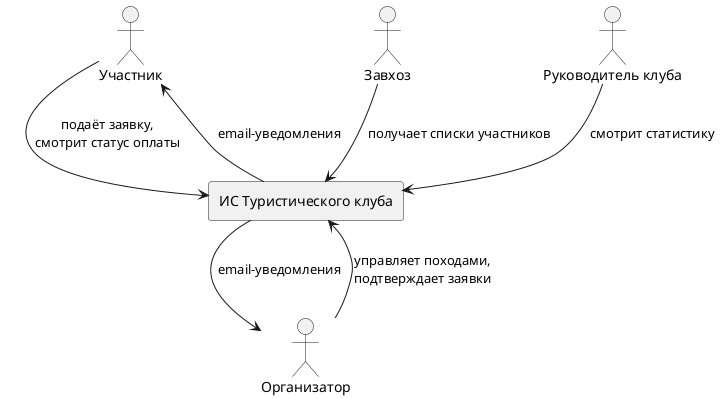
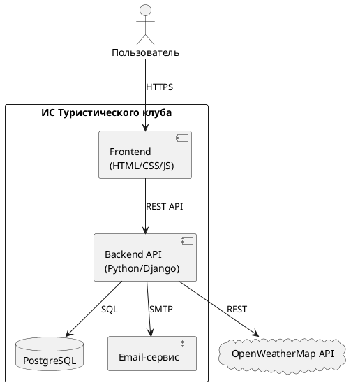

# Архитектура

## C1 - Контекстная диаграмма

Диаграмма показывает систему TourClub в окружении внешних участников.

## C2 - Контейнерная диаграмма

Диаграмма раскрывает внутренние компоненты системы и их взаимодействие.

## Внешние зависимости

| Сервис | Тип интеграции | Описание |
|--------|---------------|---------|
| OpenWeatherMap | REST (исходящий) | Погодные данные для рекомендаций снаряжения |
| SMTP-провайдер | SMTP (исходящий) | Email-уведомления участникам и организаторам |