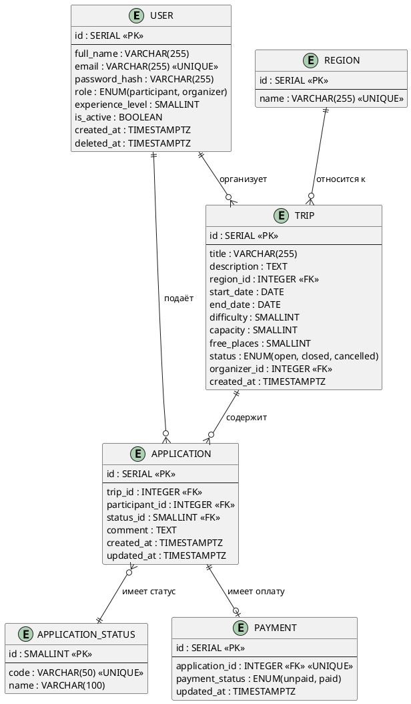

# Модель данных

## ERD-диаграмма

## Описание сущностей

### USER
Пользователи системы - участники и организаторы походов.

| Поле | Тип | Описание |
|------|-----|---------|
| id | SERIAL | Первичный ключ |
| full_name | VARCHAR(255) | Полное имя |
| email | VARCHAR(255) | Email, уникальный |
| role | ENUM | participant или organizer |
| experience_level | SMALLINT | Уровень опыта 0-5 |
| deleted_at | TIMESTAMPTZ | Мягкое удаление |

### TRIP
Походы, доступные для записи.

| Поле | Тип | Описание |
|------|-----|---------|
| id | SERIAL | Первичный ключ |
| title | VARCHAR(255) | Название похода |
| difficulty | SMALLINT | Сложность 1-5 |
| capacity | SMALLINT | Максимум участников |
| status | ENUM | open, closed, cancelled |

### APPLICATION
Заявки участников на походы.

| Поле | Тип | Описание |
|------|-----|---------|
| id | SERIAL | Первичный ключ |
| trip_id | INTEGER | Ссылка на поход |
| participant_id | INTEGER | Ссылка на участника |
| status_id | SMALLINT | Текущий статус заявки |

### PAYMENT
Факт оплаты взноса по заявке.

| Поле | Тип | Описание |
|------|-----|---------|
| id | SERIAL | Первичный ключ |
| application_id | INTEGER | Ссылка на заявку |
| payment_status | ENUM | unpaid или paid |

:::note
Оплата вынесена в отдельную сущность - в версии 2.0 появится интеграция с платёжным провайдером.
:::