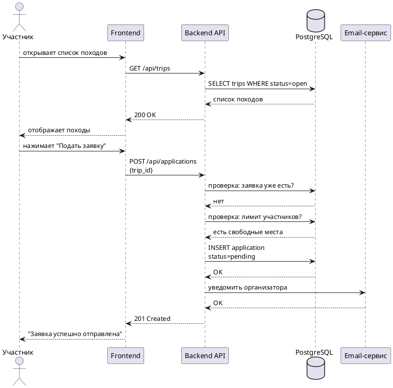

# UC-01 - Подача заявки на поход

Участник подаёт заявку через личный кабинет. После успешной подачи заявка переходит в статус `pending` и организатор получает email-уведомление.

## Алгоритм

1. Участник открывает раздел "Походы"
2. Выбирает поход со статусом `open`
3. Нажимает "Подать заявку"
4. Система проверяет: заявка уже существует?
   - Если да - возвращает ошибку "Вы уже подали заявку"
5. Система проверяет: есть свободные места?
   - Если нет - возвращает ошибку "Набор закрыт"
6. Создаёт заявку со статусом `pending`
7. Отправляет email организатору
8. Участник видит подтверждение

:::tip
Участник может отменить заявку пока она в статусе `pending`.
:::

## Предусловия

- Пользователь зарегистрирован и авторизован
- Поход имеет статус `open`
- Дата начала похода больше текущей даты

## Постусловия

- Создана заявка со статусом `pending`
- Организатор получил email-уведомление
- Участник видит заявку в личном кабинете