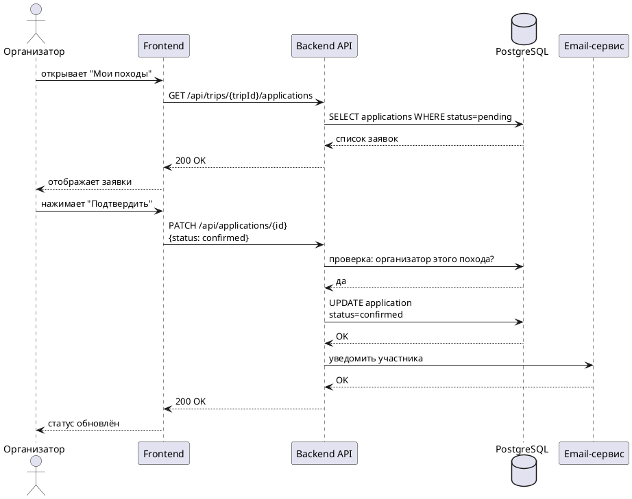

# UC-02 - Обработка заявки организатором

Организатор рассматривает заявку участника и принимает решение - подтвердить или отклонить. Участник получает email-уведомление о решении.

## Алгоритм

1. Организатор открывает раздел "Мои походы"
2. Переходит в список заявок
3. Выбирает заявку со статусом `pending`
4. Нажимает "Подтвердить" или "Отклонить"
5. Система проверяет права - организатор именно этого похода?
   - Если нет - возвращает ошибку "Недостаточно прав"
6. Обновляет статус заявки
7. Отправляет email участнику

## Предусловия

- Организатор авторизован
- Существует заявка со статусом `pending`
- Пользователь является организатором данного похода

## Постусловия

- Статус заявки изменён на `confirmed` или `rejected`
- Участник получил email-уведомление