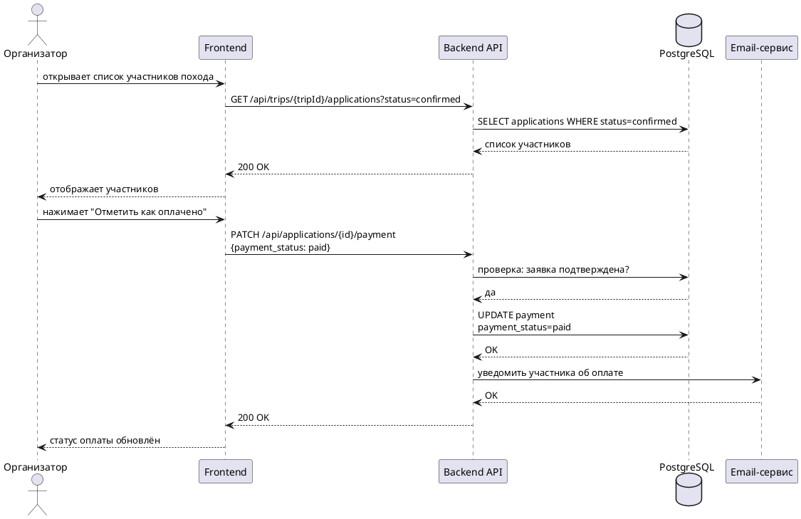

# UC-03 - Отметка об оплате

Организатор фиксирует факт оплаты взноса участником. Участник видит актуальный статус оплаты в личном кабинете.

## Алгоритм

1. Организатор открывает страницу похода
2. Переходит к списку подтверждённых участников
3. Выбирает участника и нажимает "Отметить как оплачено"
4. Система проверяет - заявка имеет статус `confirmed`?
   - Если нет - возвращает ошибку
5. Обновляет статус оплаты на `paid`
6. Отправляет email участнику

## Предусловия

- Организатор авторизован
- Заявка участника имеет статус `confirmed`

## Постусловия

- Статус оплаты изменён на `paid`
- Участник получил уведомление
- Участник видит статус "Оплачено" в личном кабинете